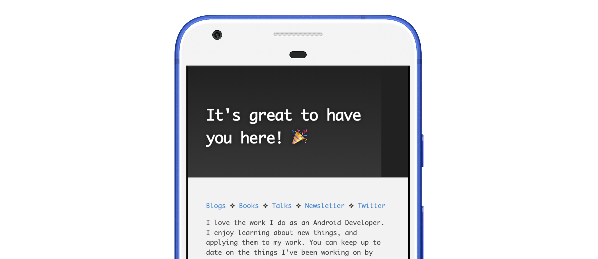

[Blogs](../../blogs.md) ❖ [Books](../../books.md) ❖ [Talks](../../talks.md) ❖ [LinkedIn](https://www.linkedin.com/in/victoriagonda/) ❖ [Twitter](https://twitter.com/TTGonda)

---

# Data Binding a Random String

Consider this situation: You have an entry screen that displays a welcome message. Each time the screen is viewed it should pick a random welcome message from a list of possible welcome messages. Say in this scenario that you're also using data binding.

You could add this randomization logic to your view model. But that feels rather overkill for assigning a resource to a text view. I ran into this exact thing and I have a solution for you.

Starting with the data, create a string array in your resource file:

```xml
<string-array name="event_attendees_empty">
    <item>Welcome! 👋</item>
    <item>It's great to have you here! 🎉</item>
</string-array>
```

You can add as many messages as you want to this array. The data binding doesn't care.

You also need to assign this array to your text view in the layout file. You'll create the binding adapter for the `randomString` property next.

```xml
<TextView
  ...
  app:randomString="@{@stringArray/event_attendees_empty}" />
```

To glue it all together, create the top level function with the `@BindingAdapter("randomString")` annotation, making sure the annotation value matches the attribute name in your layout file.

```kotlin
@BindingAdapter("randomString")
fun setRandomString(view: TextView, options: Array<String>) {
  view.text = options[Random.nextInt(options.size)]
}
```

Here, you grab a random integer to select and assign a string from the list.

And there you have it!



This blog post was helped out by [this StackOverflow answer](https://stackoverflow.com/a/36905271) about how to use string arrays in data binding. Thanks!

_02/15/2020_

-----

**Did you know I co-authored a book about testing on Android?** [Check it out](../../books.md)

---

If you like my work, consider [buying me a coffee ☕](https://www.buymeacoffee.com/96JjLEW)!
