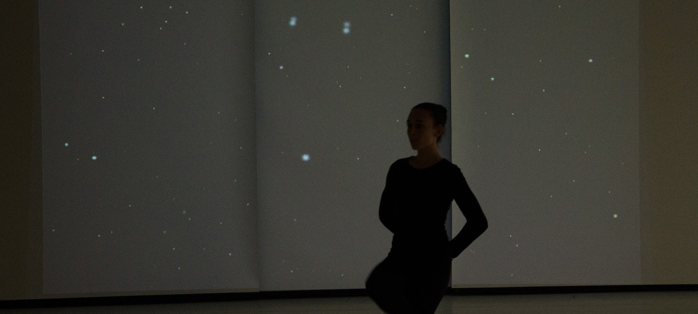
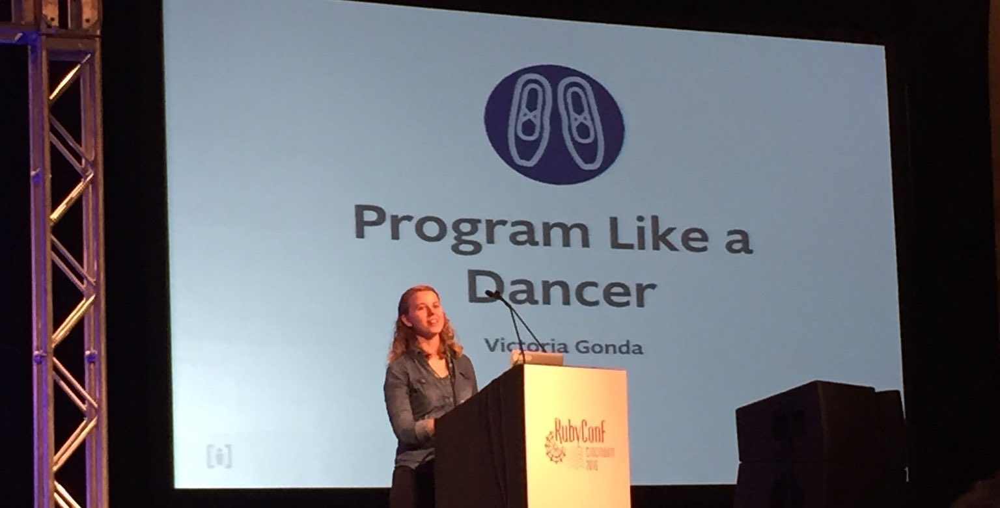
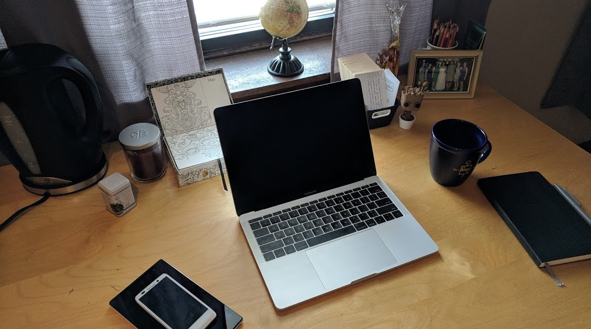
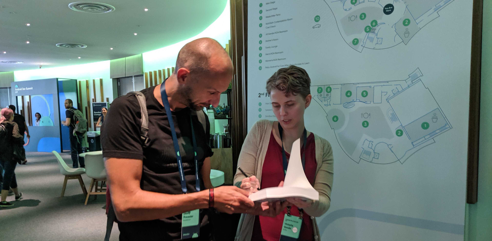
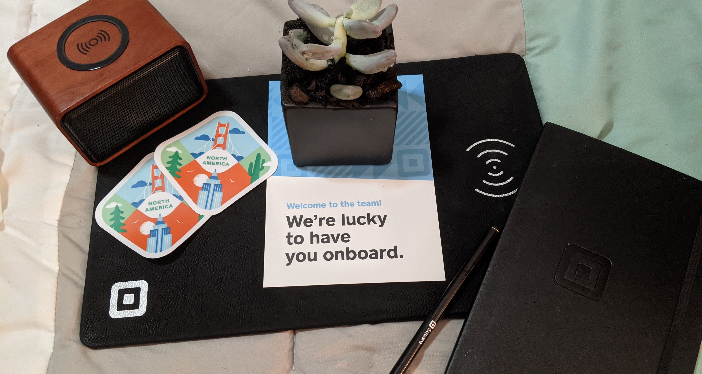

[Blogs](../../blogs.md) ❖ [Books](../../books.md) ❖ [Talks](../../talks.md) ❖ [LinkedIn](https://www.linkedin.com/in/victoriagonda/) 

---

# My Journey to Now

I've had a few people ask me about my professional journey and I've shared the story about how I grew to where I'm at today: A remote Android engineer at Square, an international public speaker, and technical book author, living and working in Michigan. I think it's time to share my story more broadly. I hope it helps other people in theirs.

## College days

When I started my education at [Hope College](https://hope.edu), I was on track to be a dance teacher. I wasn't convinced that was the career track I wanted, but I wasn't sure what else was out there for me. This is part of the reason why I chose Hope College: I saw many people combining dance with other majors. I saw it as a place to learn what I wanted to do with my career.

I made a friend early on who was studying both computer science and dance. She suggested that I try a computer science course after hearing me talk about the types of problems I enjoy solving. It satisfied a science credit I needed, so I figured why not! Turns out my friend was very right. I do enjoy programming.

From there I changed my major to Computer Science and studied both CS and dance for the rest of my time there, specializing in dance production and dance technology by the end. I had the opportunity to take part in independent studies that tailored my education to my interests.

_Constellations, a dance piece I created that used a program I wrote for the Xbox Kinect to create an interactive projection behind the dancer. Dancer: Jordan Dennen. Photo credit: Erik Alberg_

A defining moment in my time at Hope was the summer research project I was selected to take part in. Over 11 weeks I worked with a team with two other students to learn Android and [write an app](https://hope.edu/academics/computer-science/special-programs-opportunities/maxtracks-nfhc.pdf) that would help a student with cognitive disabilities ride the local bus. It was this project that showed me how I could use software to help people. From then on I knew that I wanted to work in software, striving to improve the world in the process.

## Starting my career

Beginning the summer before my senior year, I was able to land an internship at a consulting company right down the street from where I took classes in Holland, MI. Following my graduation, this turned into a full-time opportunity.

This position allowed me to work on many different types of projects. I worked on Ruby on Rails, Android, and iOS apps. I worked with clients in various industries, as well as internal products. This diversity of projects taught me flexible learning, being able to pick up the technology I needed to get the job done. I also learned how to work with many different types of people and picked up leadership skills while leading projects and mentoring interns.

While here, I also had co-workers encouraging me and supporting me in getting involved in the tech community. Starting early on I paired with other engineers on writing blog posts, and later, writing on the [company blog](https://collectiveidea.com/blog/author/victoria-gonda) independently. My colleagues pushed me out of my comfort zone by working with me to write and submit talks to tech conferences. They were with me every step of the way. Without their support, I couldn't imagine a world where I'd be giving conference talks.

_Me presenting a lightning talk at RubyConf_

The experience I had here shaped so much of my community involvement today.

## Transitioning to remote work

The next step in my journey included a decision to move to Chicago and start working fully remotely. My employer supported my decision to work and live where I was happiest, and I continued working with them from a distance. We already had a couple of remote employees in the company, and I followed their lead.

While it took some time to adjust to remote work, I found it to be my preferred way of working. I get very distracted working in an office and I'm much more focused and happy at home. This isn't to be confused with solitude. I value the interactions I have with my co-workers online and there's no substitute for the camaraderie you get from meeting in person.

_My first work from home desk set up_

During this time I also started to grow my involvement in the tech community. I started attending Meetup groups in Chicago and speaking at more conferences across the United States. I started my own blog and began writing tutorials on [raywenderlich.com](https://www.raywenderlich.com/u/vgonda).

I received feedback and improved my skills while increasing my network. This was invaluable when I was ready to take the next step in my career.

## Choosing Android development

After experiencing working in different technologies with different clients, I was ready to find some focus. I decided I wanted to focus on Android development and experience product work. Through the connections I made at conferences, I accepted a full-time Android position at a fully remote company.

During my time there, I was able to focus on my Android knowledge, while still having the opportunity to travel to conferences. Being one of two Android engineers on the team, I got broad experience over various levels of Android.

I continued learning and teaching others. With my technical expertise and teaching skills, I started writing technical books with [raywenderlich.com](https://www.raywenderlich.com/u/vgonda). With the support of the RW team, as well as the support of my friends and family, I was able to accomplish what I never thought I would be capable of. I also spoke at my first conference outside of the United States.

_Signing a book I wrote. Photo credit: Chiu-Ki Chan_

Ultimately, the company wasn't a good fit for me. The environment was not healthy for me and I stopped growing in the way I wanted to. I joined another company where I had a similar story of growth, then poor experience, which brings us to now.

## Where I am now

Today I'm happily employed at Square as an Android engineer, working remotely from Michigan. After working at small companies, it's been refreshing to work on a large team gaining real depth in my skills. I have the opportunity to specialize and pursue long-term career goals while learning from brilliant people.

_My welcome package from Square_

I've worked on a number of technical books and had incredible speaking experiences. I've started getting involved with conference planning with [Chicago Roboto](https://chicagoroboto.com/).

I feel like I have the space to take the time to evaluate what I want out of my career, community involvement, and life. For that I am grateful.

Is there something you want to know more about in my professional journey? Shoot me a message and we can chat about it!

## Acknowledgements

I know there is a lot of privilege and support that got me to where I am now and that not everyone has had the same opportunities. I'm thankful for what I have and the people I've had around me along the way. I hope I'm able to elevate your journey in the same way.

_07/11/2021_

-----

**Did you know I wrote a book about accessibility on Android?** [Check it out](../../books.md)

---

If you like my work, consider [buying me a coffee ☕](https://www.buymeacoffee.com/96JjLEW)!
