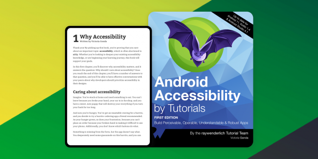

# Books

[Blogs](blogs.md) ❖ [Books](books.md) ❖ [Talks](talks.md) ❖ [LinkedIn](https://www.linkedin.com/in/victoriagonda/) ❖ [Twitter](https://twitter.com/TTGonda)

---

# [Android Accessibility by Tutorials](https://www.kodeco.com/books/android-accessibility-by-tutorials/)
_**Role:** Author_

Accessibility is an important, often overlooked, part of building a quality app. The Web Content Accessibility Guidelines (WCAG) can be confusing and it’s often unclear how to apply these guidelines to Android.

In this book, you’ll learn about building accessible apps on Android using WCAG through hands-on, step-by-step tutorials. [Read](https://www.kodeco.com/books/android-accessibility-by-tutorials/)

# [Android Test-Driven Development by Tutorials](https://www.kodeco.com/books/android-test-driven-development-by-tutorials/)
_**Role:** Author_

Writing apps is hard. Writing testable apps is even harder, but it doesn’t have to be. Reading and understanding all the official Google documentation on testing can be time-consuming — and confusing.

In this book, you’ll learn about Android test-driven development the quick and easy way: by following fun and easy-to-read tutorials. Learn to write sustainable, testable apps, as well as to apply testing strategies to legacy projects via Espresso and UI tests, code coverage and refactoring. [Read](https://www.kodeco.com/books/android-test-driven-development-by-tutorials/)

## Technical editor

### [Functional Programming in Kotlin by Tutorials](https://www.kodeco.com/books/functional-programming-in-kotlin-by-tutorials)
_**Role:** Final Pass Editor_

Functional programming is a powerful paradigm for building your applications. This book will teach you the fundamentals of functional programming in a practical, hands-on way, while showing you how you can safely handle errors and state changes in your programs. [Read](https://www.kodeco.com/books/functional-programming-in-kotlin-by-tutorials)

### [Kotlin Apprentice](https://www.kodeco.com/books/kotlin-apprentice)
_**Role:** Final Pass Editor, Updater_

For complete beginners to Kotlin. No prior programming experience necessary!

This is a book for complete beginners to the new, modern Kotlin language.

Everything in the book takes place in a clean, modern development environment, which means you can focus on the core features of programming in the Kotlin language, without getting bogged down in the many details of building apps.

This is a sister book to the Android Apprentice the Android Apprentice focuses on making apps for Android, while the Kotlin Apprentice focuses on the Kotlin language fundamentals. [Read](https://www.kodeco.com/books/kotlin-apprentice)

### [Reactive Programming with Kotlin](https://www.kodeco.com/books/reactive-programming-with-kotlin/)
_**Role:** Tech Editor_

Learn Reactive Programming in Kotlin with RxJava!

Not only will you learn how to use RxJava to create complex reactive applications on Android, you’ll also see how to solve common application design issues by using RxJava, RxAndroid and RxKotlin. Finally, you’ll discover how to exercise full control over the library and leverage the full power of reactive programming in your apps. Specifically, learn to handle asynchronous event sequences via two key concepts in Rx—Observables and Observers.

Hone your UI development with RxJava and companion libraries to make it easy to work with the UI of your apps, providing a reactive approach to handling user events. Dig into both intermediate and advanced topics, such as error handling, schedulers, app architecture, repositories, and integrating RxJava with Android Jetpack. [Read](https://www.kodeco.com/books/reactive-programming-with-kotlin/)

---

If you like my work, consider [buying me a coffee ☕](https://www.buymeacoffee.com/96JjLEW)!
