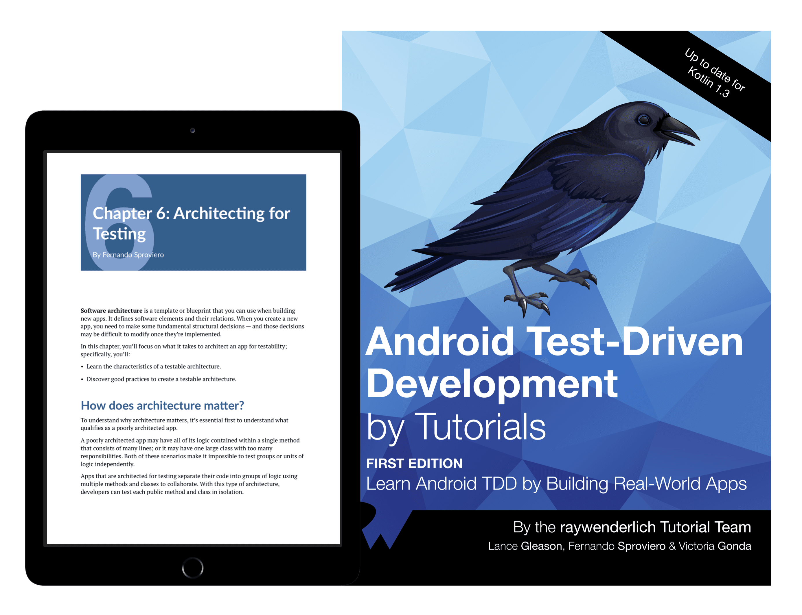

# Books

[Blogs](blogs.md) ❖ [Books](books.md) ❖ [Talks](talks.md) ❖ [Newsletter](https://tinyletter.com/vgonda) ❖ [Twitter](https://twitter.com/TTGonda)

---

# [Android Test-Driven Development by Tutorials](https://store.raywenderlich.com/products/android-test-driven-development-by-tutorials)
_**Role:** Author_

A book that teaches you to write sustainable, testable apps, as well as to apply testing strategies to legacy projects via Espresso and UI tests, code coverage and refactoring. [Read](https://store.raywenderlich.com/products/android-test-driven-development-by-tutorials)

# [Reactive Programming with Kotlin](https://store.raywenderlich.com/products/reactive-programming-with-kotlin)
_**Role:** Tech Editor_

The book that teaches you to use RxJava, RxAndroid and RxKotlin to create complex reactive applications on Android and exercise full control over the library to leverage the full power of reactive programming in your apps. [Read](https://store.raywenderlich.com/products/reactive-programming-with-kotlin)
