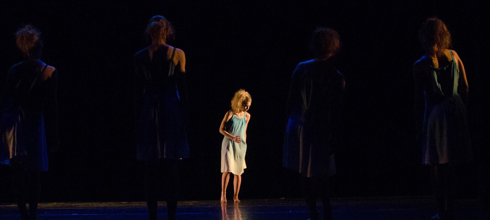
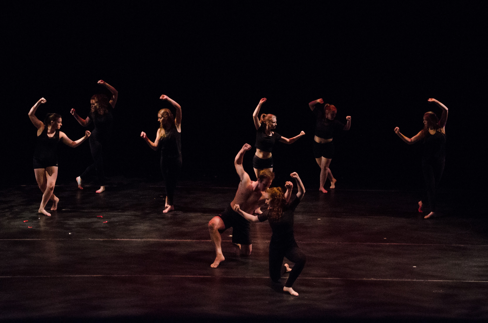
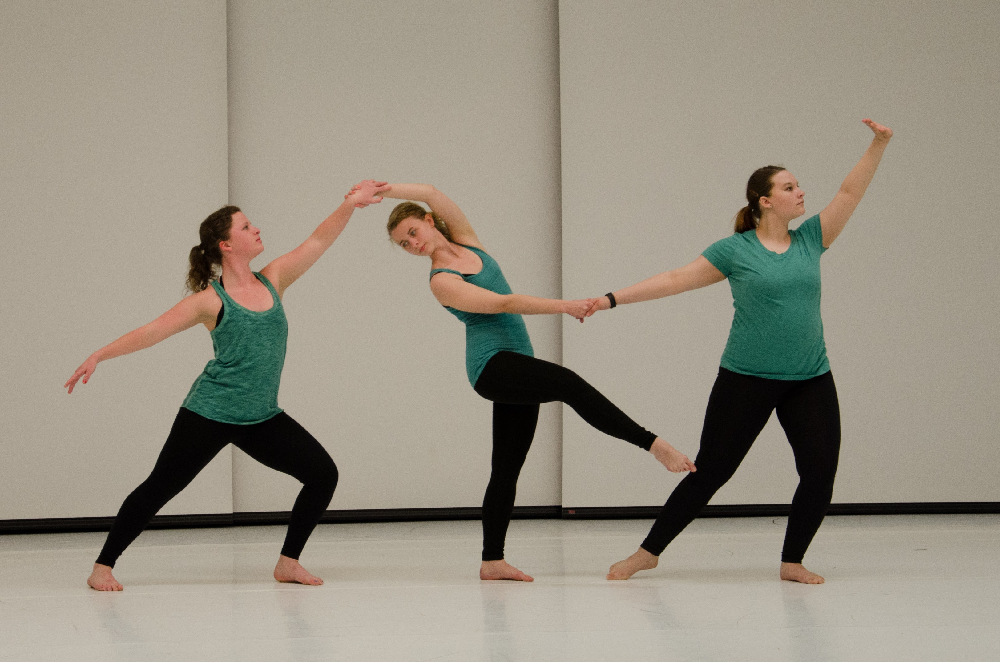
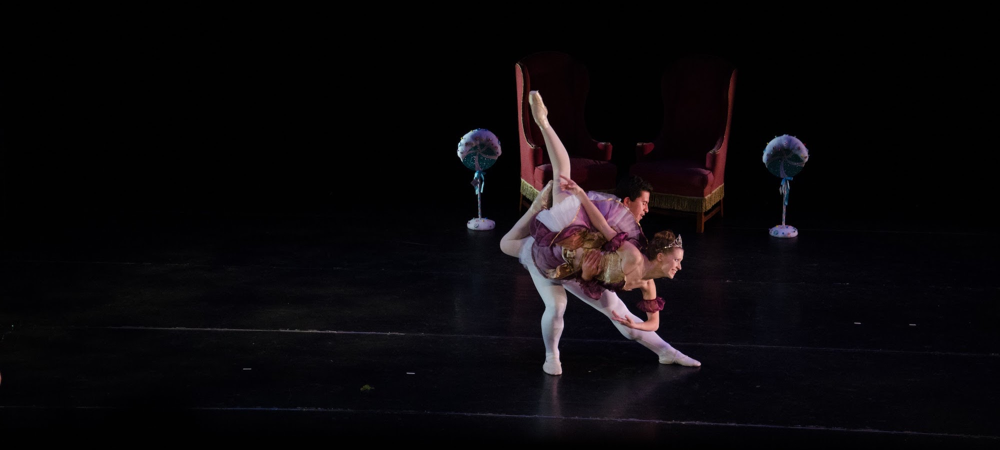
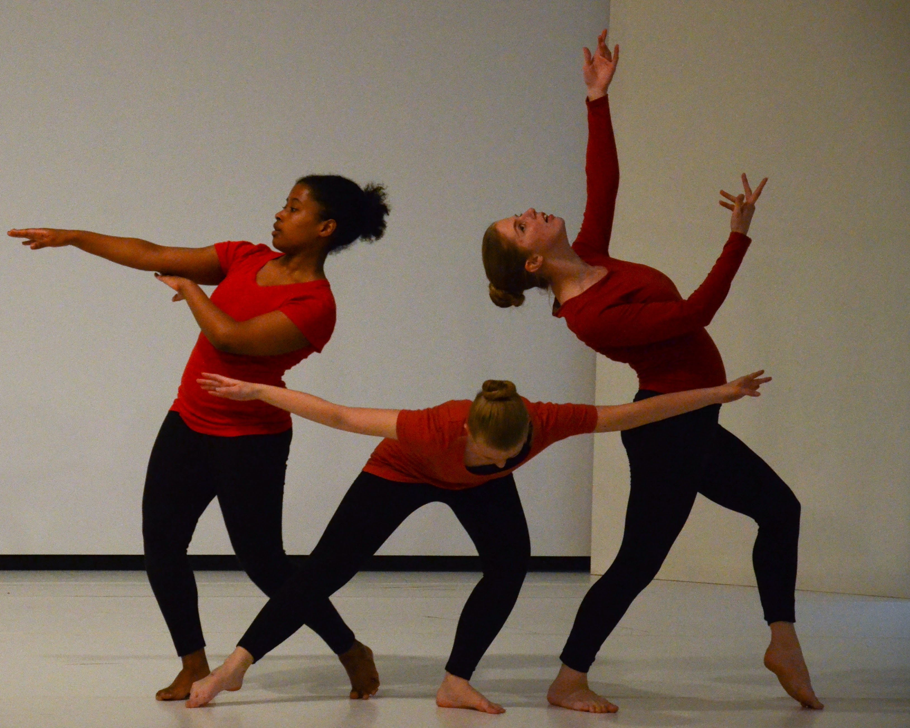
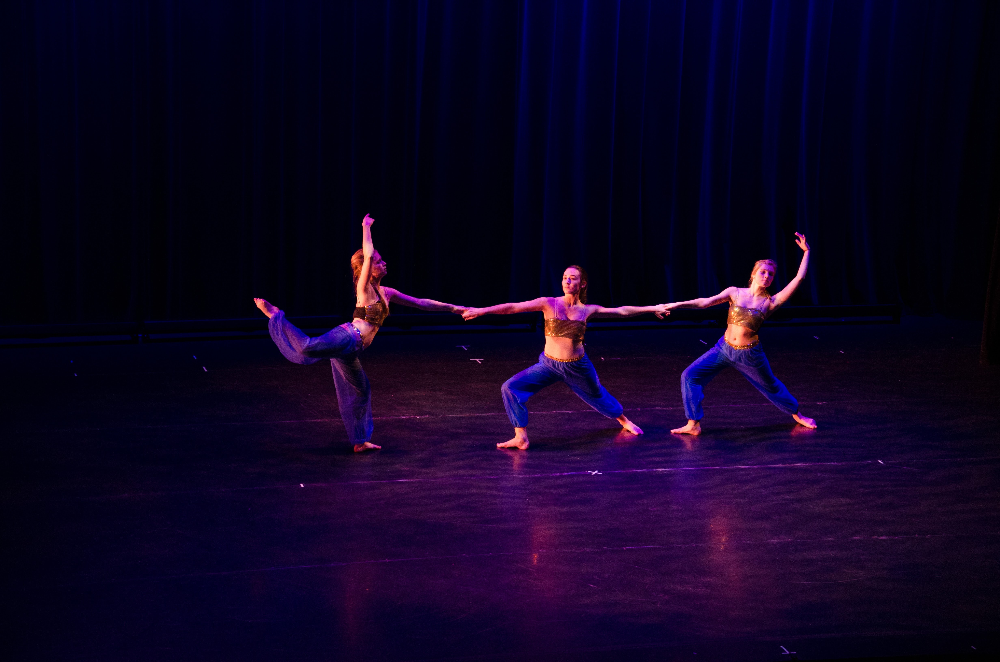

# Dance design, choreography, and performance

[Blogs](blogs.md) ❖ [Books](books.md) ❖ [Talks](talks.md) ❖ [Newsletter](https://tinyletter.com/vgonda) ❖ [Twitter](https://twitter.com/TTGonda)

---
## The Nutcracker - Lighting Designer
### Michigan Ballet Academy
_December 2016_

## Wonderland - Projection Designer
### Hope College - Ballet Club
Projection Designer: **Victoria Gonda**

_Spring 2016_

## A Tale Begun in Other Days - Lighting Designer
### Hope College - Dance 42
Choreographer: Matt Farmer

Lighting Designer: **Victoria Gonda**

_Spring 2016, photo credit: Erik Alberg_

## Reluctant Reconciliation - Lighting Designer
### Hope College - Knickerbocker Student Dance Concert
Choreographer: Kelsey Hutten

Lighting Designer: **Victoria Gonda**

Music: Desi Wilkinson and Sliotar
Watch

_Spring 2015, photo credit: Erik Alberg_

## Constellations - Choreographer/Designer
### Hope College - Dow Student Dance Concert
Choreographer: **Victoria Gonda**

Dancer: Jordan Dennen

Projection Designer: **Victoria Gonda**

Music: **Victoria Gonda**

In this piece I wrote a program for an Xbox Kinnect sensor that was used during the performance to track the dancer's movement, and use those movements to project a constellation behind them that matched their movements.

_Spring 2015, photo credit: Erik Alberg_

## Reciprocity - Performer
### Hope College - Dow Student Dance Concert
Choreographer: Kirsten Monson

Dancers: Becca Bremmer, Mica Carson, **Victoria Gonda**

_Spring 2015, photo credit: Erik Alberg_

## Fractured - Projection Designer
### Hope College - Dance 41
Choreographer: Sharon Wong

Projection Designers: **Victoria Gonda** and Erik Alberg

_Spring 2015, photo credit: Erik Alberg_

## Nutcracker - Lighting Designer
### Hope College - Ballet Club
Lighting Designer: **Victoria Gonda**

_Fall 2014, photo credit: Erik Alberg_

## Student Dance Concert - Lighting Designer
### Hope College - Knickerbocker
Choreographer: Kelsey Hutten

Lighting Designer: **Victoria Gonda**

_Spring 2014_

## Student Dance Concert - Lighting Designer
### Hope College - Knickerbocker
Choreographer: Jenny Lingenfetter

Lighting Designer: **Victoria Gonda**

_Spring 2014_

## Pythagorean Triple - Choreographer
### Hope College - Dow Student Dance Concert
Choreographer: **Victoria Gonda**

Performers: Kirsten Monson, Victoria Gonda, Jaunine Hackmon

_Spring 2014, photo credit: Erik Alberg_

## Sacred Dance - Performer
### Hope College - Sacred Dance
_Spring 2014_

## Chinese - Performer
### Hope College - Ballet Club Nutcracker
Choreographer: Gabby Plaep

_Fall 2013_

## Arabian - Lighting Designer
### Hope College - Knickerbocker Student Dance Concert
Lighting Designers: **Victoria Gonda** and Noelle Hannay

_Fall 2013, photo credit: Erik Alberg_

## Russian Dance - Performer
### Hope College - Ballet Club Nutcracker
Choreographer: Kelsey Hutten

_Fall 2012_
